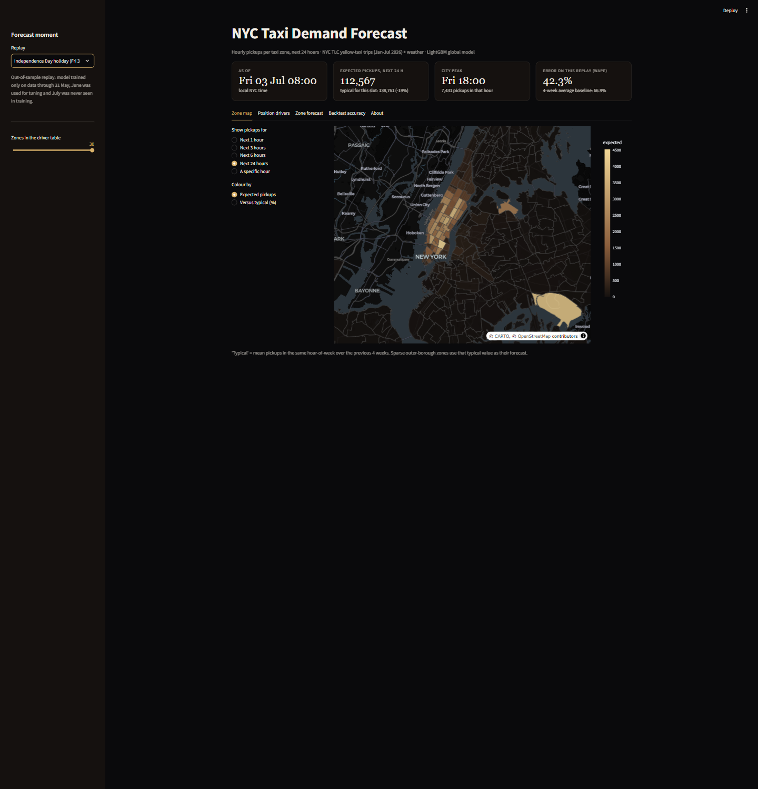
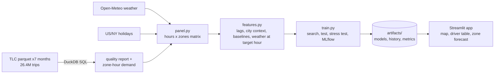
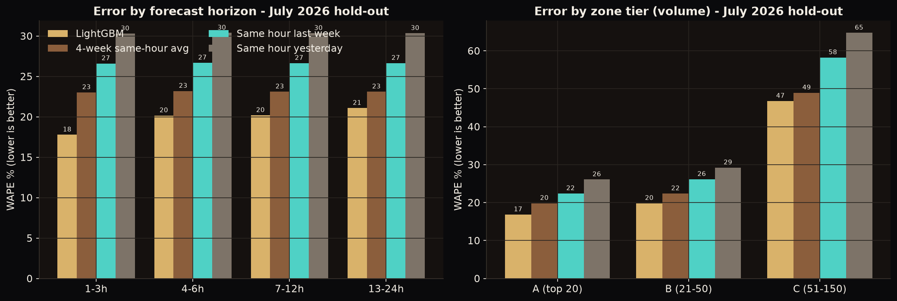
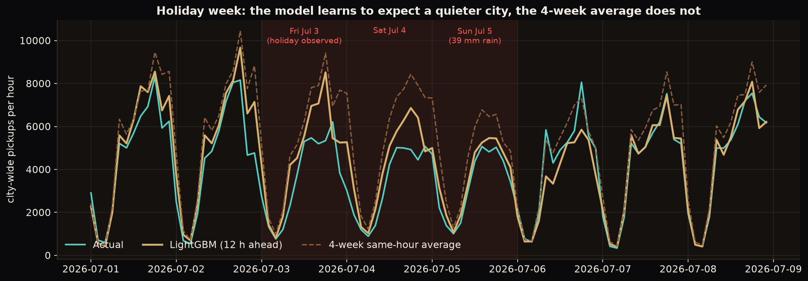
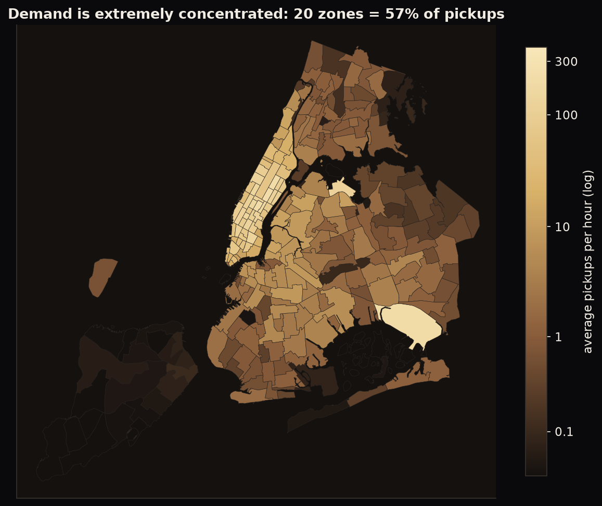

# NYC Taxi Demand Forecasting for Fleet Operations

Forecasts hourly taxi pickups for every NYC taxi zone over the next 24 hours so a fleet operator can position drivers before demand appears. Built on **25.8 million real trips**, aggregated with DuckDB SQL, modelled with LightGBM, delivered as an interactive Streamlit app with a zone-demand map.

**Live demo:** _added after deployment_ · **Stack:** DuckDB, Python, LightGBM, MLflow, Streamlit + Plotly maps, GitHub Actions



## 1. Business problem

| | |
|---|---|
| **Stakeholder** | Fleet operations / dispatch lead at a taxi or ride-hailing operator |
| **Decision** | Which zones to send idle drivers to over the next 1-24 hours, to cut passenger wait times |
| **KPIs** | (1) Forecast error per zone tier (MAPE, WAPE, RMSE) vs simple baselines; (2) **top-10 hit rate**: of the 10 zones we say will be busiest in the next 3 h, how many really are; (3) behaviour on holidays and storms |

## 2. Data (real, public, no login)

| Source | Use | Licence |
|---|---|---|
| [NYC TLC Trip Record Data](https://www.nyc.gov/site/tlc/about/tlc-trip-record-data.page): yellow-taxi parquet, Jan-Jul 2026 | 26,366,639 raw trips | NYC Open Data terms |
| TLC taxi-zone lookup + zone shapefile | Zone names, boroughs, map polygons | same |
| [Open-Meteo Historical Weather API](https://open-meteo.com/en/docs/historical-weather-api) | Hourly temperature, apparent temperature, precipitation, snowfall, wind, cloud, humidity | CC BY 4.0 |

**Data-quality audit** (`artifacts/quality_report.json`), computed in one DuckDB SQL pass over the parquet files; the first failing rule wins so counts add up:

| Reason | Trips |
|---|---|
| Pickup timestamp outside the file period (years like 2001, 2008) | 54 |
| Unknown pickup zone (264 / 265) | 42,487 |
| Dropoff not after pickup | 328,048 |
| Negative total amount (refund / dispute) | 146,743 |
| **Valid trips (98.0%)** | **25,849,307** |

802,277 valid trips have zero distance and 1,036 exceed 100 miles. They are **kept**: for a *demand* forecast they are real pickup events. Demand = valid pickups per (zone, local hour). The hour that does not exist at daylight-saving start (2026-03-08 02:00) is dropped from the grid, otherwise it would look like a false zero-demand hour.

## 3. Architecture



## 4. Approach

**Framing.** Direct multi-horizon forecasting: one row = *(forecast origin t, zone, horizon h = 1…24)*. Features known at the origin: the zone's lags (0-168 h), rolling means/std/max, city-wide demand, and **how unusual the current hour is versus the same hour-of-week average** (`now_vs_ha4`). Known for the target hour: clock, holiday flags, and weather (in production, the weather *forecast*). 56 features.

**Baselines** (all evaluated on the same rows): same hour yesterday, same hour last week, and the **4-week historical average of the same hour-of-week** (a strong baseline: it already removes most of the weekly pattern).

**Model.** One LightGBM per horizon bucket (1-3, 4-6, 7-12, 13-24 h), shared by the top **150 zones = 99.05% of trips**. Target = `log1p(y) − log1p(4-week average)`, so busy and quiet zones train together. The 110 sparse tail zones (< 1 pickup/hour) are not modelled; they use the 4-week average.

**Choices found by experiment, not assumed** (validation month): predicting the *ratio to the seasonal baseline* beat raw-count Poisson on the smaller zones (tier C WAPE 47-48% vs 51%); adding median/week-by-week references helped little.

**Evaluation protocol (time-ordered, no leakage):**
* train: Jan-May 2026 · validation: June (random search over 7 configs, metric MAPE) · **test: July 2026, scored once**
* **stress test:** the four blizzard days (Jan 25-26, Feb 22-23) are held out of training
* production model: refit on all data through 31 Jul with the chosen parameters
* MLflow (local SQLite) tracks the pipeline run and the 7 tuning trials. Tests check that features never see the future (`tests/test_features_models.py`).

**Metric definitions.** MAPE only on zone-hours with ≥ 5 actual pickups (otherwise undefined/explosive; that is ~48% of zone-hours); **WAPE** = Σ|error| / Σ actual covers every cell; RMSE in pickups per zone-hour.

## 5. Results: held-out July 2026 (384 origins × 150 zones × 24 h = 1.34M forecasts)

| Model | MAPE | WAPE | RMSE | Top-10 zones found (next 3 h) |
|---|---|---|---|---|
| **LightGBM** | **28.7%** | **20.3%** | **15.3** | **86.8%** |
| 4-week same-hour average | 32.2% | 23.1% | 18.1 | 84.6% |
| Same hour last week | 37.1% | 26.6% | 20.7 | 81.8% |
| Same hour yesterday | 44.5% | 30.3% | 24.4 | 78.4% |

**By zone tier** (tier A = 20 busiest zones = 57% of trips; B = ranks 21-50; C = 51-150):

| Tier | MAPE LightGBM / 4-wk avg | WAPE LightGBM / 4-wk avg | RMSE LightGBM / 4-wk avg |
|---|---|---|---|
| A (top 20) | 22.5% / 27.6% | 16.8% / 19.8% | 35.9 / 42.6 |
| B (21-50) | 25.3% / 28.7% | 19.8% / 22.4% | 16.8 / 19.8 |
| C (51-150) | 37.5% / 39.8% | 46.8% / 48.9% | 3.3 / 3.5 |

**By horizon (WAPE, LightGBM vs 4-week average):** 1-3 h **17.8%** vs 23.0% · 4-6 h 20.2% vs 23.2% · 7-12 h 20.2% vs 23.1% · 13-24 h 21.1% vs 23.1%.



**City-wide total** (sum of the 150 zones): WAPE 11.4% vs 14.2% for the 4-week average.

**Holidays and weather (WAPE):** holiday days (Fri Jul 3 observed, Sat Jul 4) **43.9% vs 66.3%**; non-holiday 19.1% vs 20.9%; rain ≥ 0.5 mm/h 23.4% vs 26.5%; dry 19.8% vs 22.5%.



**Blizzard stress test** (345,600 zone-hours from days held out of training): WAPE **82.4%** vs 89.4% (4-week average) vs 94.2% (same hour last week).

## 6. Key insights

* **Demand is extremely concentrated:** 20 zones = 56.7% of pickups, 50 zones = 90%. The busiest are Upper East Side South/North, Midtown, JFK, Penn Station, Times Square.
* **Hour-of-week is the backbone.** The evening peak (17-19h, Tue-Thu) is roughly 10× the 3-5 am trough; Fri/Sat nights have a second peak.
* **Two blizzards and the holidays break the pattern:** Jan 25 (19.6 cm snow) cut daily demand to 0.39× typical, Feb 23 to 0.24×; Jul 3-4 to ~0.62-0.66×.
* **Drivers of the forecast (SHAP):** the 4-week average and same-hour-yesterday references, the city-wide "busier than usual" ratio, the hour of day, the zone's volume. Weather adds little in a summer test month.



## 7. Limitations & honest caveats

* **The model's advantage is real but modest and horizon-dependent.** It clearly beats the 4-week average in the first 6 hours (17.8% vs 23.0% WAPE at 1-3 h), but by 13-24 h the gain is 2 points; hourly zone demand is inherently noisy.
* **Weather is observed, not forecast, in training and evaluation.** In production, forecast errors will make rain/snow accuracy somewhat worse than reported.
* **Storms are largely unpredictable in magnitude:** 82% WAPE even with the true snowfall as input; the training data holds only a handful of blizzard hours. Use a manual scenario when a storm warning is issued.
* **Holidays are only partly captured:** the model still over-forecasts the holiday-Friday evening peak (roughly 8,500 vs 6,200 city-wide pickups/hour).
* **Seven months of data:** no autumn, no New Year's Eve, no marathons/concerts; one test month (July) that includes a holiday and a 39 mm rain day, which makes it harder than a typical month.
* **Yellow taxis only, and pickups ≠ unmet demand.** The TLC publishes with a lag of about two months, so the app **replays history**; a production deployment needs a live trip feed.
* The zone-tier grouping is by *training-period* volume (no leakage from the test month).

## 8. Repository layout

```
src/taxidemand/  config, ingest (DuckDB SQL), panel, features, models, evaluate, train, inference, geo, report, viz
app/             Streamlit app: zone map, position-drivers table, zone forecast, backtest accuracy
notebooks/       01_eda_quality_patterns.ipynb, 02_modeling_evaluation.ipynb (executed)
tests/           11 tests: SQL quality rules on a synthetic parquet, DST/holidays, leakage guard, alignment, model, metrics
artifacts/       committed outputs for the app (~29 MB: two models, hourly history, weather, zone shapes, metrics)
reports/figures/ charts used here and on the portfolio
.github/workflows/ci.yml   ruff + pytest on every push
Dockerfile       container for the app
```

## 9. How to run

```bash
uv sync --all-groups && uv pip install -e .
uv run python -m taxidemand.ingest     # download 7 TLC files (~450 MB) + weather, SQL aggregation (~3 min)
uv run python -m taxidemand.train      # search, evaluation, stress test, production refit (~20 min on 8 cores)
uv run python -m taxidemand.geo        # zone polygons -> artifacts/zones.geojson (dev extras)
uv run python -m taxidemand.report     # figures
uv run pytest -q && uv run ruff check .
uv run streamlit run app/streamlit_app.py
uv run mlflow ui --backend-store-uri sqlite:///mlflow.db
docker build -t taxi-demand . && docker run -p 8501:8501 taxi-demand
```

In the app pick a replay moment (holiday, heavy-rain Sunday, a typical Friday evening, or the latest hour with data). Replays inside June-July use the **out-of-sample model trained only on data through 31 May**; the latest-hour view uses the production model. Deploy free on Streamlit Community Cloud with main file `app/streamlit_app.py` (dependencies from `requirements.txt`; the app reads only the committed `artifacts/`).

_Data © NYC Taxi & Limousine Commission (public data) and Open-Meteo.com (CC BY 4.0)._
